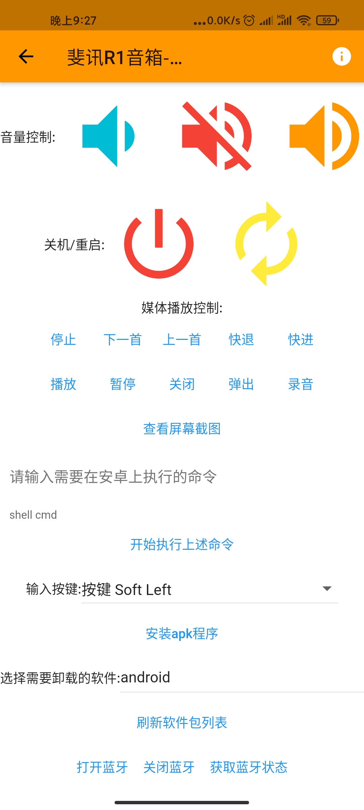

# phicomm-r1-controler
[](https://snapcraft.io/phicomm-r1-controler)

##### 斐讯R1的控制插件，配合云易连app:https://github.com/OpenIoTHub/OpenIoTHub
* 首先下载本插件，到(releases page)[releases]下载时候你系统的本插件
* 手机安装云易连(releases page][https://github.com/OpenIoTHub/OpenIoTHub/releases]
* 安装本插件的主机需要安装adb并把adb放入系统PATH目录(就是系统终端输入adb回车就能执行adb的状态)
* 先运行一次本插件，本插件会默认在当前目录生成一个yaml配置文件
* 按照配置文件的例子配置你的斐讯R1的ip地址
* 然后再运行一次本插件
* （本插件可以通过 -c 参数指定配置文件位置）
* 安装运行本插件之后将装有云易连的手机与本插件在同一个网络下操作，云易连可以发现配置的R1设备
* 如果你想云易连的手机和插件不是同一个网络也能控制，请安装[云易连网关](https://github.com/OpenIoTHub/gateway-go/releases) 如果只需要局域网控制请忽略

```sh
phicomm-r1-controler -c /path/to/config/file/phicomm-r1-controler.yaml
```
or just:
```
phicomm-r1-controler
```
(use default config file: ./phicomm-r1-controler.yaml)

Here are the steps for each of them:

## Install the pre-compiled binary

**homebrew tap** :

```sh
$ brew install OpenIoTHub/tap/phicomm-r1-controler
```

**homebrew** (may not be the latest version):

```sh
$ brew install phicomm-r1-controler
```

**snapcraft**:

```sh
$ sudo snap install phicomm-r1-controler
```
config file path: /root/snap/phicomm-r1-controler/current/phicomm-r1-controler.yaml

edit config file then:
```sh
sudo snap restart phicomm-r1-controler
```

**scoop**:

```sh
$ scoop bucket add OpenIoTHub https://github.com/OpenIoTHub/scoop-bucket.git
$ scoop install phicomm-r1-controler
```

**deb/rpm**:

Download the `.deb` or `.rpm` from the [releases page][releases] and
install with `dpkg -i` and `rpm -i` respectively.

config file path: /etc/phicomm-r1-controler/phicomm-r1-controler.yaml

edit config file then:
```sh
sudo systemctl restart phicomm-r1-controler
```

**manually**:

Download the pre-compiled binaries from the [releases page][releases] and
copy to the desired location.

[releases]: https://github.com/IoTDevice/phicomm-r1-controler/releases

